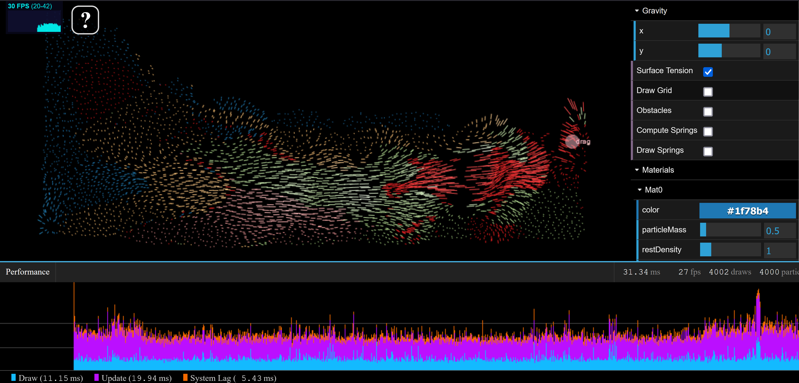
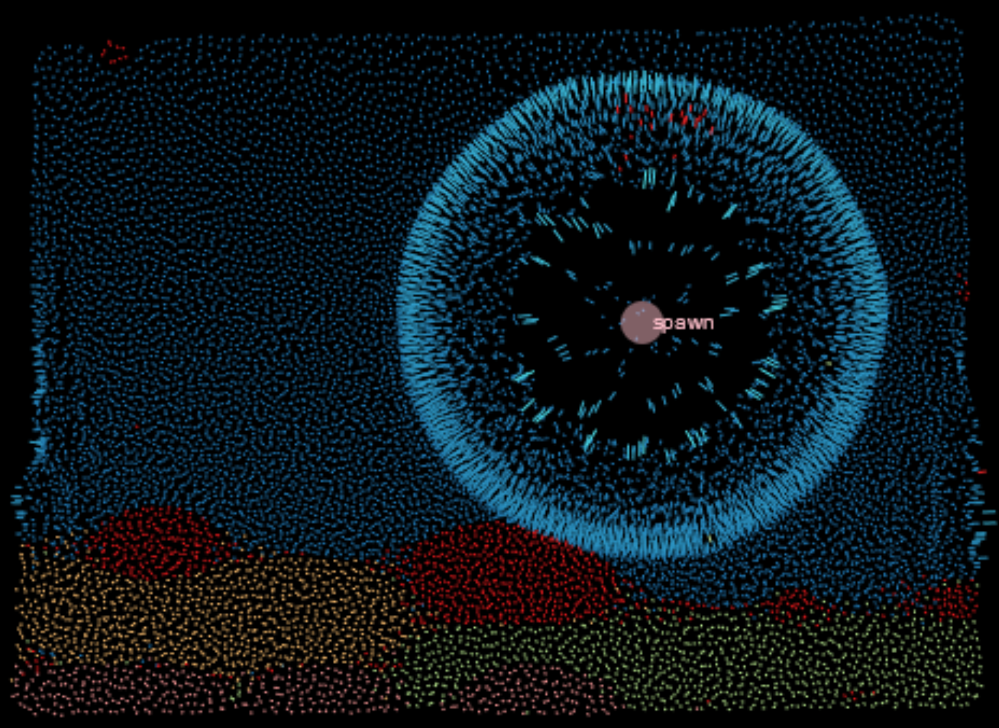

floom
=====

A JavaScript Fluid Simulation using the Material Point Method (MPM), a hybrid simulation using particles and a grid.

## Try it out!

View an [example](http://onsetsu.github.io/floom/example.html) at Github pages.

